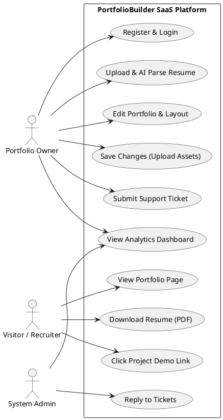
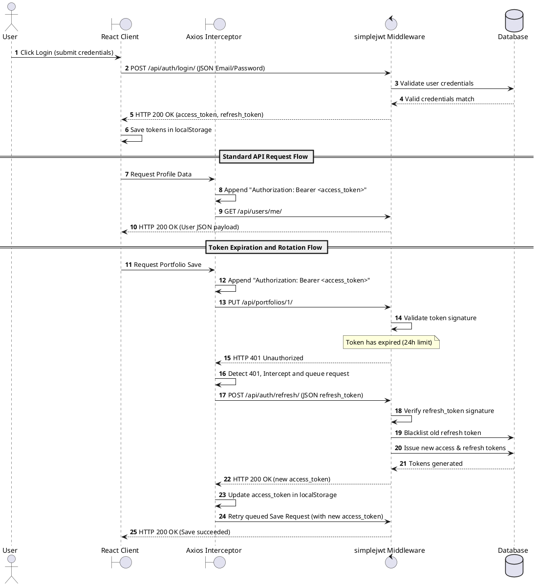
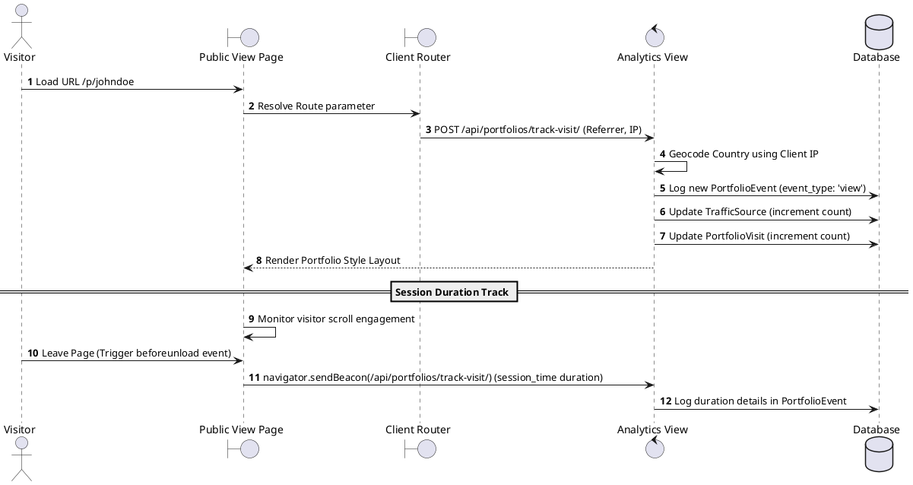
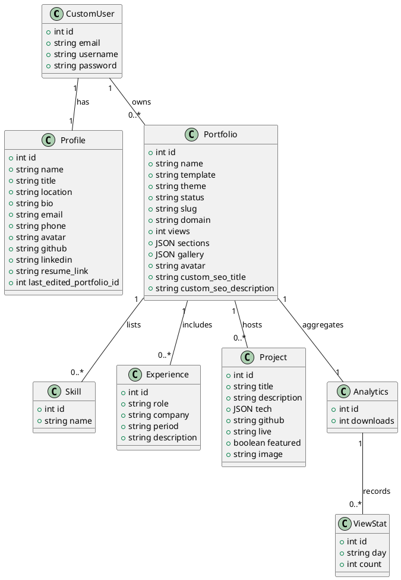

# Chapter 4: System Design

## 4.1 System Architecture

PortfolioBuilder uses a decoupled multi-tier architectural pattern. The front-end React 19 application acts as a Single Page Application (SPA), rendering views on the client side. The back-end Django 6 application acts as a RESTful API gateway, managing database records, static assets, and third-party AI connections.

```
+---------------------------------------------------------------------------------+
|                               SYSTEM TOPOOLOGY                                  |
+-------------------+                                       +---------------------+
|   React SPA       | <========= HTTP REST / JWT =========> |   Django Gateway    |
| (Vite 7 Bundle)   |                                       | (WSGI / Gunicorn)   |
+-------------------+                                       +---------------------+
                                                               |          |
                                                 PostgreSQL    |          | HTTPS
                                                 ORM Query     v          v
                                                            +----+     +----------+
                                                            | DB |     | AI APIs  |
                                                            +----+     +----------+
```

### Architectural Tiers:
1. **Client Tier**: A React application bundled via Vite 7. Client routing is managed by `react-router-dom`, while Zustand manages user authentication and portfolio builder states.
2. **API Gateway Tier**: Django REST Framework handles routing, simplejwt authentication, CORS origins, and upload security.
3. **Database Tier**: Relational storage (SQLite locally, PostgreSQL in production).
4. **Integration Tier**: Handles file text extraction (`pdfplumber` / `mammoth`), AI processing (Groq / Google GenAI), and asset management (Cloudinary).

---

## 4.2 Entity Relationship Diagram (ERD)

The database schema is organized around the `Portfolio` model, which acts as the core relational hub linking user profiles to their education, projects, experiences, and analytics records.

### Relational Schema Diagram:

```
                  +-------------------+
                  |    CustomUser     |
                  +-------------------+
                     | 1           | 1
                     |             |
                     | 1           | 1
                  +------+      +---------+
                  |Profile|      |Portfolio| <---------+
                  +------+      +---------+           |
                                   | 1                 | 1
                                   |                   |
                                   v 1..*              |
                              +----------+             | 1
                              | Skills   |             |
                              | Projects |             |
                              | Experience             |
                              | Education|             |
                              | Blogs    |             |
                              | FAQs     |             |
                              +----------+             |
                                                       |
                                                       v 1
                                                 +-----------+
                                                 | Analytics |
                                                 +-----------+
                                                    | 1
                                                    |
                                                    v 1..*
                                                 +-----------+
                                                 | ViewStats |
                                                 | DevStats  |
                                                 | Country   |
                                                 +-----------+
```

---

## 4.3 Database Schema Tables

### Table 4.1: CustomUser Table (`users_customuser`)
| Field Name | Data Type | Null/Blank | Constraints | Description |
| :--- | :--- | :--- | :--- | :--- |
| `id` | Integer | No | Primary Key, Auto-increment | Unique identifier |
| `email` | EmailField | No | Unique, Indexed | Username for authentication |
| `username` | CharField(150) | No | Unique | Fallback username |
| `password` | CharField(128) | No | - | Hashed password |

### Table 4.2: Profile Table (`users_profile`)
| Field Name | Data Type | Null/Blank | Constraints | Description |
| :--- | :--- | :--- | :--- | :--- |
| `id` | Integer | No | Primary Key | Unique identifier |
| `user` | OneToOneField | No | Foreign Key to CustomUser | Link to user credentials |
| `name` | CharField(150) | Yes / Yes | - | User's full name |
| `title` | CharField(150) | Yes / Yes | - | Professional headline |
| `location` | CharField(150) | Yes / Yes | - | Geographic location |
| `bio` | TextField | Yes / Yes | - | Professional bio |
| `email` | EmailField | Yes / Yes | - | Independent contact email |
| `phone` | CharField(30) | Yes / Yes | - | Contact phone number |
| `avatar` | TextField | Yes / Yes | - | Base64 string or Cloudinary URL |
| `github` | URLField | Yes / Yes | - | GitHub profile link |
| `linkedin` | URLField | Yes / Yes | - | LinkedIn profile link |
| `resume_link` | TextField | Yes / Yes | - | Base64 encoded resume file |
| `last_edited_portfolio_id` | Integer | Yes / Yes | - | Session continuity tracker |

### Table 4.3: Portfolio Table (`portfolios_portfolio`)
| Field Name | Data Type | Null/Blank | Constraints | Description |
| :--- | :--- | :--- | :--- | :--- |
| `id` | Integer | No | Primary Key | Unique identifier |
| `user` | ForeignKey | No | Foreign Key to CustomUser | Link to owner |
| `name` | CharField(255) | No | Default: "Personal Portfolio" | Portfolio name |
| `template` | CharField(100) | No | Default: "Developer" | Selected layout style |
| `theme` | CharField(100) | No | Default: "Midnight" | Selected theme style |
| `status` | CharField(50) | No | Choices: Draft, Published | Deployment status |
| `slug` | SlugField | Yes / Yes | Unique | SEO-friendly URL slug |
| `domain` | CharField(255) | Yes / Yes | Unique | Connected custom domain |
| `views` | Integer | No | Default: 0 | Total view count |
| `sections` | JSONField | Yes / Yes | Default: list | Custom layout sections |
| `gallery` | JSONField | Yes / Yes | Default: list | User portfolio images |
| `videos` | JSONField | Yes / Yes | Default: list | Linked video files |
| `music` | JSONField | Yes / Yes | Default: list | Embedded audio players |
| `avatar` | TextField | Yes / Yes | - | Per-portfolio avatar image |
| `custom_seo_title` | CharField(70) | Yes / Yes | - | SEO title tag override |
| `custom_seo_description` | CharField(160) | Yes / Yes | - | SEO description tag override |
| `custom_og_image`| URLField | Yes / Yes | - | Social share image override |

### Table 4.4: Project Table (`portfolios_project`)
| Field Name | Data Type | Null/Blank | Constraints | Description |
| :--- | :--- | :--- | :--- | :--- |
| `id` | Integer | No | Primary Key | Unique identifier |
| `portfolio` | ForeignKey | No | Foreign Key to Portfolio | Parent portfolio link |
| `title` | CharField(255) | No | - | Project name |
| `description` | TextField | Yes / Yes | - | Detailed project summary |
| `tech` | JSONField | Yes / Yes | Default: list | Technologies list |
| `github` | CharField(500) | Yes / Yes | - | GitHub repository URL |
| `live` | CharField(500) | Yes / Yes | - | Live application URL |
| `featured` | BooleanField | No | Default: False | Feature toggle status |
| `image` | TextField | Yes / Yes | - | Base64 or Cloudinary URL |

### Table 4.5: PortfolioEvent Table (`portfolios_portfolioevent`)
| Field Name | Data Type | Null/Blank | Constraints | Description |
| :--- | :--- | :--- | :--- | :--- |
| `id` | Integer | No | Primary Key | Unique identifier |
| `portfolio` | ForeignKey | No | Foreign Key to Portfolio | Parent portfolio link |
| `event_type` | CharField(50) | No | - | Event: view, download, session_time |
| `visitor_id` | CharField(255) | No | - | Visitor signature hash |
| `duration` | Integer | No | Default: 0 | Session duration in seconds |
| `device` | CharField(50) | No | Default: "Desktop" | Client device category |
| `country` | CharField(100) | No | Default: "United States" | Country resolved from IP |
| `created_at` | DateTimeField | No | Auto_now_add | Timestamp of event |

---

## 4.4 PlantUML Diagrams

### 4.4.1 Use Case Diagram



### 4.4.2 Activity Diagram: Onboarding and Resume Parsing

```plantuml
@startuml
start
:User uploads Resume file (PDF or DOCX);
if (Is file size < 10MB AND format valid?) then (yes)
  :Extract text using pdfplumber/mammoth;
  if (Is text extracted successfully?) then (yes)
    :Attempt Groq Parsing (Llama-3.3-70b-versatile);
    if (Groq parsing succeeds?) then (yes)
      :Retrieve parsed JSON response;
    else (no)
      :Trigger Gemini cascade fallback chain;
      if (Does Gemini cascade succeed?) then (yes)
        :Retrieve parsed JSON response;
      else (no)
        :Run local heuristic parsing fallback;
        :Extract fields using regex and keywords;
      endstyle
      endif
    endif
    :Validate and sanitize parsed JSON payload;
    :Map parsed records to Profile structure;
    :Render structured data in Onboarding Wizard;
    :Save configurations to Database;
    stop
  else (no)
    :Return Extraction Error;
    stop
  endif
else (no)
  :Return File Validation Error;
  stop
endif
@enduml
```

### 4.4.3 Sequence Diagram: Authentication and Token Rotation



### 4.4.4 Sequence Diagram: Public Visitor Tracking



### 4.4.5 Database Class Diagram


