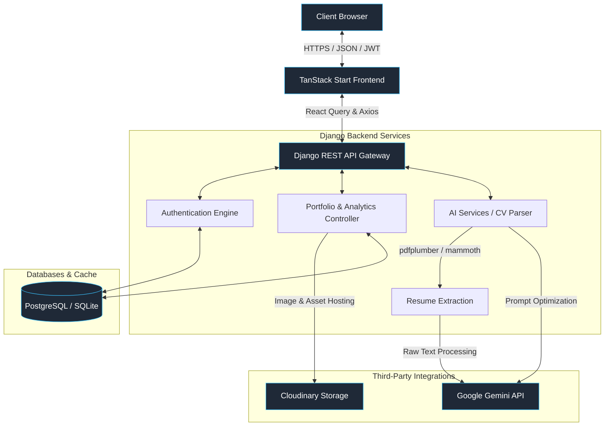

# 🚀 PortfolioBuilder — AI-Powered Portfolio SaaS

[](https://react.dev/)
[](https://tanstack.com/router/v1/docs/start/overview)
[](https://tailwindcss.com/)
[](https://www.djangoproject.com/)
[](https://ai.google.dev/)
[](https://opensource.org/licenses/MIT)

**PortfolioBuilder** is a state-of-the-art, fully-featured Software-as-a-Service (SaaS) platform that enables developers, designers, writers, and professionals to build stunning digital portfolios in seconds. Backed by **Google Gemini AI**, users can instantly upload a resume (PDF/DOCX) or paste raw text to auto-parse, structure, and generate high-converting digital web portfolios with customized themes and interactive real-time analytics.

---

## 🎨 Layout Showcase & Themes

PortfolioBuilder features a decoupled, modular template system. Users can switch their look instantly across **7 distinct layouts**, customized with harmonious dark/light theme palettes (such as Midnight, Emerald, Cyberpunk, and Minimal):

*   🏛️ **BizLayout**: Clean, structured, corporate design suited for consultants and agencies.
*   ⚡ **BoldLayout**: Strong accents, huge headings, and striking typography.
*   💾 **BrutalistLayout**: Neo-brutalist styling with thick black borders, retro shadow boxes, and high contrast.
*   🔮 **GlassLayout**: Modern glassmorphism with subtle blurs, sleek gradients, and floating elements.
*   🍃 **MinimalLayout**: Ultra-clean, spacing-first design highlighting typography and photography.
*   📂 **SidebarLayout**: Classic side-navigation structure ideal for reading logs and technical docs.
*   🌓 **SplitLayout**: Interactive split-screen layout with sticky resume highlights and scrollable details.

---

## 🌟 Core Features

### 🧙 1. AI-Powered Resume Parser & Onboarding
Upload standard `.pdf` or `.docx` resumes. The backend utilizes **pdfplumber**, **mammoth**, **Groq Cloud (Llama models)**, and **Google GenAI** to extract contact details, professional summaries, work histories, projects, skills, certifications, and education, instantly building a structured DB model in the background. A robust local heuristic parser acts as a failover fallback to ensure parsing success even without API keys.

### ✍️ 2. Deep AI Writing & Copywriting Assistant
*   **Contextual Chat Assistant**: An interactive ChatGPT-like widget nested inside the builder dashboard that answers portfolio design questions or suggests copy modifications.
*   **AI Paragraph Rewriter**: Instantly switch tones (Professional, Creative, Confident, Minimalist).
*   **AI Bio & Project Optimizer**: Enhance the "About Me" segment or refine technical projects with high-impact action verbs.

### 📊 3. Advanced Geolocation & Engagement Analytics
An interactive analytics dashboard built with **Recharts** tracks visitor interactions live:
*   **Referral & Traffic Sources Chart**: Visualizes visitor traffic channels (e.g. LinkedIn, GitHub, Google, Direct/Search Engine, custom urls) using sleek modern diagrams.
*   **Interactive Geolocation Tracker**: Logs country views by mapping visitor IPs to target geolocations.
*   **Device & Session Analyzer**: Visualizes access ratios of Mobile vs. Tablet vs. Desktop.
*   **Project Click Analytics**: Logs the exact count and timestamps of clicks on specific GitHub or Live links.
*   **Duration & Bounce Rate Monitor**: Measures active scroll time and visitor sessions.

### 💼 4. Support Desk & Ticket Hub
A fully-featured Help Center that houses structured self-service documentation alongside a dynamic feedback/contact-ticket form linked straight to the Django admin panel for direct follow-ups.

---

## 🏗️ System Architecture

The following diagram illustrates how the frontend app, backend API, databases, and third-party AI services interact:



---

## 🛠️ Technology Stack

| Layer | Technology | Purpose |
| :--- | :--- | :--- |
| **Frontend** | [React 19](https://react.dev/) & [TypeScript](https://www.typescriptlang.org/) | Core UI engine & strong type-safety |
| | [TanStack Start](https://tanstack.com/router/v1/docs/start/overview) | Full-stack routing framework with React Router |
| | [Tailwind CSS v4](https://tailwindcss.com/) | Next-generation styling engine with seamless performance |
| | [Zustand](https://github.com/pmndrs/zustand) | Ultra-lightweight global client state management |
| | [TanStack React Query](https://tanstack.com/query/v4) | Server cache synchronization and asynchronous queries |
| | [Framer Motion](https://www.framer.com/motion/) | Smooth layout morphs and interactive micro-animations |
| | [Recharts](https://recharts.org/) | Premium, modular visitor and geolocation data visualization |
| | [Shadcn UI](https://ui.shadcn.com/) & [Radix UI](https://www.radix-ui.com/) | Pre-styled unstyled accessible UI primitives |
| **Backend** | [Django 6.0](https://www.djangoproject.com/) | Main high-performance MVC/API framework |
| | [Django REST Framework](https://www.django-rest-framework.org/) | Clean Restful API design, views, and serialization |
| | [dj-rest-auth](https://django-rest-auth.readthedocs.io/) & [simple-jwt](https://django-rest-framework-simplejwt.readthedocs.io/) | Stateless token-based JSON Web Token authorization |
| **AI / Parsers** | [Google GenAI SDK](https://github.com/google/generative-ai-python) & [Groq SDK](https://github.com/groq/groq-python) | Dual-engine AI completions with automatic Llama/Gemini failover |
| | [pdfplumber](https://github.com/jasonmc/pdfplumber) & [mammoth](https://github.com/mwilliamson/python-mammoth) | Rich text extractors for PDF & DOCX resumes |
| | [Playwright](https://playwright.dev/) | Headless browser for live portfolio snapshots & testing |
| **Storage & Email** | [Cloudinary](https://cloudinary.com/) | Automated media optimizations and cloud hosting for uploads |
| | [Resend SDK](https://resend.com/) & SMTP | Transactional, scalable email delivery pipelines |
| | [WhiteNoise](http://whitenoise.evans.io/) | Serving compiled front-end bundles and assets directly via WSGI |

---

## 📂 Project Structure

```bash
PortfolioBuilder/
├── backend/                   # Django REST Backend Application
│   ├── ai/                    # Gemini API integration & CV parsing views
│   │   ├── services/          # ai_parser.py (PDF/DOCX processing logic)
│   │   └── views.py           # Core AI endpoints (rewrite, assistant, CV parsing)
│   ├── analytics/             # Event-listeners and visitor logging
│   ├── authentication/        # Registration & Token auth configs
│   ├── core/                  # Project configuration, URLs, and ASGI/WSGI
│   │   ├── settings.py        # Django core settings
│   │   └── urls.py            # Root URL API mapping
│   ├── portfolios/            # Portfolio models, custom fields, and views
│   │   ├── models.py          # Portfolio, Project, Experience, Analytics models
│   │   └── views.py           # CRUD views, templates, geolocation trackers
│   ├── support/               # Help Center tickets and contact logs
│   ├── users/                 # Custom User Model & profiles
│   ├── manage.py              # CLI Django Admin
│   ├── requirements.txt       # Python dependencies
│   ├── render.yaml            # Render Cloud Blueprint
│   └── railway.json           # Railway App Blueprint
├── frontend/                  # React & TanStack Start Frontend Application
│   ├── src/
│   │   ├── app/
│   │   │   ├── pages/         # Dashboard, Analytics, CVPreview, PortfolioEditor
│   │   │   ├── templates/     # Dynamic render layouts (Glass, Minimal, Brutalist...)
│   │   │   ├── services/      # api.js (Axios engine + auto JWT Refresh Interceptor)
│   │   │   └── store/         # Zustand global states
│   │   ├── components/        # Shared shadcn & interactive components
│   │   ├── routes/            # TanStack Start Route definitions
│   │   └── styles.css         # Tailwind v4 entry and core design tokens
│   ├── tsconfig.json          # TypeScript definitions
│   └── vite.config.ts         # Vite bundler options
└── render.yaml                # Global Render multi-service configuration
```

---

## 🚀 Local Installation & Setup

### Prerequisites
Make sure you have the following installed on your machine:
*   [Node.js](https://nodejs.org/) (v18+) or [Bun](https://bun.sh/)
*   [Python](https://www.python.org/) (v3.10+)
*   A [Google Gemini API Key](https://aistudio.google.com/)
*   A [Cloudinary Account](https://cloudinary.com/) (for dynamic images/avatar storage)

---

### 🐍 1. Backend Setup (Django)

1.  **Navigate to the backend directory**:
    ```bash
    cd backend
    ```

2.  **Create and activate a virtual environment**:
    ```bash
    # Windows
    python -m venv venv
    venv\Scripts\activate

    # macOS/Linux
    python3 -m venv venv
    source venv/bin/activate
    ```

3.  **Install dependencies**:
    ```bash
    pip install -r requirements.txt
    ```

4.  **Configure environment variables**:
    Create a `.env` file in the `backend` directory (copying from `.env.example`):
    ```env
    DEBUG=True
    SECRET_KEY=dev-secret-key-12345
    GEMINI_API_KEY=your_google_gemini_api_key
    CLOUDINARY_CLOUD_NAME=your_cloudinary_cloud_name
    CLOUDINARY_API_KEY=your_cloudinary_api_key
    CLOUDINARY_API_SECRET=your_cloudinary_api_secret
    CORS_ALLOWED_ORIGINS=http://localhost:3000,http://localhost:5173

    # Optional AI & Email Keys
    GROQ_API_KEY=your_groq_api_key
    RESEND_API_KEY=your_resend_api_key

    # Optional SMTP configuration (console default)
    EMAIL_BACKEND=django.core.mail.backends.console.EmailBackend
    EMAIL_HOST=smtp.gmail.com
    EMAIL_PORT=587
    EMAIL_USE_TLS=True
    EMAIL_HOST_USER=your_email_user@gmail.com
    EMAIL_HOST_PASSWORD=your_email_app_password
    ```

5.  **Run Migrations**:
    ```bash
    python manage.py migrate
    ```

6.  **Create a superuser** (for the Django Admin panel):
    ```bash
    python manage.py createsuperuser
    ```

7.  **Start the development server**:
    ```bash
    python manage.py runserver
    ```
    The backend API will be available at `http://localhost:8000/api/`.

---

### ⚛️ 2. Frontend Setup (React / TanStack Start)

1.  **Navigate to the frontend directory**:
    ```bash
    cd ../frontend
    ```

2.  **Install node packages**:
    ```bash
    # If using Bun (Recommended)
    bun install

    # If using NPM
    npm install
    ```

3.  **Configure environment variables**:
    Create a `.env` file in the `frontend` directory:
    ```env
    VITE_API_URL=http://localhost:8000/api
    ```

4.  **Start the frontend development server**:
    ```bash
    # Using Bun
    bun run dev

    # Using NPM
    npm run dev
    ```
    Open your browser and navigate to `http://localhost:5173`. You should see the Landing Page!

---

## ☁️ Production Deployment

### 1. Render Deploy (`render.yaml`)
This repository comes with a preconfigured `render.yaml` blueprint. 
To launch on Render:
1. Push your project to a remote GitHub repository.
2. Go to **Render Dashboard** -> **Blueprints** -> **New Blueprint Instance**.
3. Connect your repository. Render will automatically deploy:
   - The Django application as a web service.
   - Run the automated `build.sh` script (installing packages and collecting static assets). Database migrations are automatically executed in the start command (`python manage.py migrate`) before starting the Gunicorn WSGI server.
   - Configure a managed PostgreSQL database.
4. Input your `GEMINI_API_KEY`, `GROQ_API_KEY` (optional), `RESEND_API_KEY` (optional), SMTP variables, Cloudinary configurations, and set `DEBUG` to `False` in Render's environment settings.

### 2. Railway Deploy (`railway.json`)
For quick, low-latency deployments:
1. Connect your repository to [Railway](https://railway.app/).
2. Railway reads `backend/railway.json` using the Nixpacks builder.
3. Simply add a PostgreSQL plugin inside your Railway project. Railway will automatically link database variables inside your environment.
4. Add your secrets to the Railway variables panel.

---

## 🤝 Contributing

We welcome contributions of any size! If you would like to submit new portfolio layouts, add dashboard charts, or improve AI prompting pipelines:
1. **Fork** the repository.
2. Create a new branch: `git checkout -b feature/amazing-layout`.
3. Commit your changes: `git commit -m "feat: add cyber brutalist layout"`.
4. Push to the branch: `git push origin feature/amazing-layout`.
5. Open a **Pull Request**.

---

## 📄 License

Distributed under the MIT License. See `LICENSE` for more information.

---

*Made with ❤️ by [Indrasish007](https://github.com/Indrasish007) & pair-programmed with Antigravity.*
