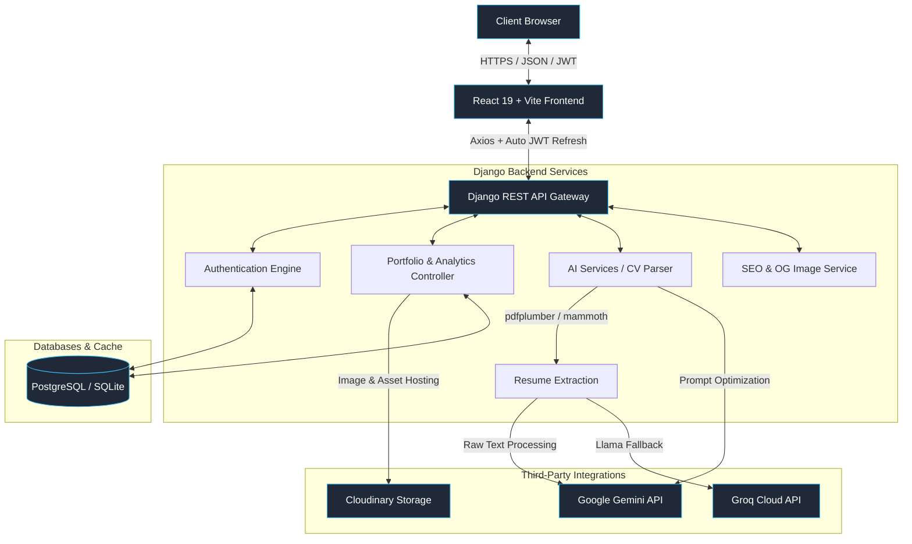

# 🚀 PortfolioBuilder — AI-Powered Portfolio SaaS

[](https://react.dev/)
[](https://reactrouter.com/)
[](https://tailwindcss.com/)
[](https://www.djangoproject.com/)
[](https://ai.google.dev/)
[](https://opensource.org/licenses/MIT)

**PortfolioBuilder** is a state-of-the-art, fully-featured Software-as-a-Service (SaaS) platform that enables developers, designers, writers, and professionals to build stunning digital portfolios in seconds. Backed by **Google Gemini AI** and **Groq (Llama)**, users can instantly upload a resume (PDF/DOCX) or paste raw text to auto-parse, structure, and generate high-converting digital web portfolios with customizable themes and interactive real-time analytics.

---

## 🎨 Layout Showcase & Themes

PortfolioBuilder features a decoupled, modular template system. Users can switch their look instantly across **7 distinct layouts**, each customizable with harmonious dark/light theme palettes (such as Midnight, Emerald, Cyberpunk, and Minimal):

*   🏛️ **BizLayout**: Clean, structured, corporate design suited for consultants and agencies.
*   ⚡ **BoldLayout**: Strong accents, huge headings, and striking typography.
*   💾 **BrutalistLayout**: Neo-brutalist styling with thick black borders, retro shadow boxes, and high contrast.
*   🔮 **GlassLayout**: Modern glassmorphism with subtle blurs, sleek gradients, and floating elements.
*   🍃 **MinimalLayout**: Ultra-clean, spacing-first design highlighting typography and photography.
*   📂 **SidebarLayout**: Classic side-navigation structure ideal for technical docs and reading logs.
*   🌓 **SplitLayout**: Interactive split-screen layout with sticky resume highlights and scrollable details.

---

## 🌟 Core Features

### 🧙 1. AI-Powered Resume Parser & Onboarding
Upload standard `.pdf` or `.docx` resumes. The backend uses **pdfplumber**, **mammoth**, **Groq Cloud (Llama models)**, and **Google GenAI** to extract contact details, professional summaries, work histories, projects, skills, certifications, and education — instantly building a structured DB model. A robust local heuristic parser acts as a failover fallback to ensure parsing success even without API keys.

### ✍️ 2. Deep AI Writing & Copywriting Assistant
*   **Contextual Chat Assistant**: An interactive ChatGPT-like widget inside the builder dashboard that answers portfolio design questions or suggests copy modifications.
*   **AI Paragraph Rewriter**: Instantly switch tones (Professional, Creative, Confident, Minimalist).
*   **AI Bio & Project Optimizer**: Enhance the "About Me" segment or refine technical projects with high-impact action verbs.

### 📊 3. Advanced Geolocation & Engagement Analytics
An interactive analytics dashboard built with **Recharts** tracks visitor interactions in real time:
*   **Referral & Traffic Sources Chart**: Visualizes visitor traffic channels (LinkedIn, GitHub, Google, Direct, custom URLs) using sleek modern diagrams.
*   **Interactive Geolocation Tracker**: Logs country views by mapping visitor IPs to target geolocations.
*   **Device & Session Analyzer**: Visualizes access ratios of Mobile vs. Tablet vs. Desktop.
*   **Project Click Analytics**: Logs the exact count and timestamps of clicks on specific GitHub or Live links.
*   **Duration & Bounce Rate Monitor**: Measures active scroll time and visitor sessions.

### 🗃️ 4. Rich Portfolio Data Model
Each portfolio supports a deep set of structured data, all managed through the editor:
Skills, Experience, Education, Projects (with GitHub/Live links & featured flag), Certifications, Testimonials, Blog posts, Gallery images, Videos, Music, Services, Languages, Volunteer work, Awards, References, and FAQs.

### 🔍 5. SEO Engine & Open Graph Generation
*   **Auto-generated SEO metadata**: Title, meta description, and JSON-LD structured data are auto-computed from portfolio content.
*   **Canonical URLs & Sitemap**: Portfolios get a canonical URL (`/p/:slug` or `/u/:username`) with an auto-generated sitemap.
*   **Open Graph Images**: Dynamic OG image generation (via ReportLab) for rich link previews on social platforms.
*   **Owner-controlled SEO overrides**: Portfolio owners can customize the SEO title, description, and OG image from the editor.

### 💼 6. Support Desk & Ticket Hub
A fully-featured Help Center with structured self-service documentation alongside a dynamic feedback/contact-ticket form linked straight to the Django admin panel for direct follow-ups.

### ⚙️ 7. Account Settings & Profile Management
A comprehensive settings page for managing account info, linked social profiles (GitHub, LinkedIn, Twitter, Facebook, Instagram, Calendly, personal website), avatar upload via Cloudinary, password change, and email preferences.

### 📄 8. CV Preview & Export
A dedicated CV/resume preview page that renders a printable, exportable version of the user's portfolio data — formatted as a clean resume document.

---

## 🏗️ System Architecture

The following diagram illustrates how the frontend app, backend API, databases, and third-party AI services interact:



---

## 🛠️ Technology Stack

| Layer | Technology | Purpose |
| :--- | :--- | :--- |
| **Frontend** | [React 19](https://react.dev/) | Core UI engine |
| | [React Router v7](https://reactrouter.com/) | Client-side routing with nested layouts |
| | [Vite 7](https://vitejs.dev/) | Lightning-fast dev server & bundler |
| | [Tailwind CSS v4](https://tailwindcss.com/) | Next-generation styling engine |
| | [Zustand v5](https://github.com/pmndrs/zustand) | Ultra-lightweight global client state management |
| | [TanStack React Query v5](https://tanstack.com/query/v5) | Server cache synchronization and async queries |
| | [Framer Motion v12](https://www.framer.com/motion/) | Smooth layout morphs and interactive micro-animations |
| | [Recharts](https://recharts.org/) | Premium, modular visitor and geolocation data visualization |
| | [Shadcn UI](https://ui.shadcn.com/) & [Radix UI](https://www.radix-ui.com/) | Pre-styled accessible UI primitives |
| | [Lucide React](https://lucide.dev/) | Icon set |
| | [Axios](https://axios-http.com/) | HTTP client with auto JWT refresh interceptor |
| | [React Hook Form](https://react-hook-form.com/) + [Zod](https://zod.dev/) | Form management and schema validation |
| | [Sonner](https://sonner.emilkowal.ski/) | Toast notification system |
| | [QRCode.react](https://github.com/zpao/qrcode.react) | QR code generation for portfolio links |
| **Backend** | [Django 6.0](https://www.djangoproject.com/) | Main high-performance MVC/API framework |
| | [Django REST Framework](https://www.django-rest-framework.org/) | Clean RESTful API design, views, and serialization |
| | [dj-rest-auth](https://dj-rest-auth.readthedocs.io/) & [SimpleJWT](https://django-rest-framework-simplejwt.readthedocs.io/) | Stateless JWT token-based authorization |
| | [django-allauth](https://django-allauth.readthedocs.io/) | Advanced registration & social auth flows |
| | [Gunicorn](https://gunicorn.org/) | Production WSGI server |
| **AI / Parsers** | [Google GenAI SDK](https://github.com/google/generative-ai-python) & [Groq SDK](https://github.com/groq/groq-python) | Dual-engine AI completions with automatic Gemini/Llama failover |
| | [pdfplumber](https://github.com/jasonmc/pdfplumber) & [mammoth](https://github.com/mwilliamson/python-mammoth) | Rich text extractors for PDF & DOCX resumes |
| | [Playwright](https://playwright.dev/) | Headless browser for live portfolio snapshots |
| | [ReportLab](https://www.reportlab.com/) | Dynamic OG image & PDF generation |
| | [BeautifulSoup4](https://www.crummy.com/software/BeautifulSoup/) | HTML parsing for web scraping utilities |
| **Storage & Email** | [Cloudinary](https://cloudinary.com/) | Automated media optimizations and cloud hosting |
| | [Resend SDK](https://resend.com/) & SMTP | Transactional, scalable email delivery pipelines |
| | [WhiteNoise](http://whitenoise.evans.io/) | Serving compiled static bundles via WSGI |

---

## 📂 Project Structure

```bash
PortfolioBuilder/
├── backend/                    # Django REST Backend Application
│   ├── ai/                     # AI integration & CV parsing views
│   │   ├── services/           # ai_parser.py (PDF/DOCX processing logic)
│   │   └── views.py            # AI endpoints (rewrite, assistant, CV parsing)
│   ├── analytics/              # Event-listeners and visitor logging
│   ├── authentication/         # Registration & JWT auth configs
│   ├── core/                   # Project config, URLs, and ASGI/WSGI
│   │   ├── settings.py         # Django core settings
│   │   └── urls.py             # Root URL API mapping
│   ├── portfolios/             # Portfolio models, custom fields, and views
│   │   ├── models.py           # Portfolio, Project, Experience, Analytics models
│   │   ├── serializers.py      # DRF serializers with nested model support
│   │   ├── services/           # seo.py, og_image.py, sitemap.py
│   │   └── views.py            # CRUD views, geolocation trackers, slug routing
│   ├── support/                # Help Center tickets and contact logs
│   ├── themes/                 # Theme definitions and palette management
│   ├── users/                  # Custom User Model & profiles
│   ├── manage.py               # Django CLI
│   ├── requirements.txt        # Python dependencies
│   ├── Procfile                # Process file for Render/Railway
│   ├── build.sh                # Static asset build script (Render)
│   ├── run_migrations.py       # Pre-start migration runner
│   ├── render.yaml             # Render Cloud Blueprint (backend)
│   ├── railway.json            # Railway App Blueprint
│   └── vercel.json             # Vercel serverless deployment config
├── frontend/                   # React 19 + Vite Frontend Application
│   ├── src/
│   │   └── app/
│   │       ├── App.jsx         # Root router and layout composition
│   │       ├── pages/          # All app pages (see Page Routes below)
│   │       ├── templates/      # Dynamic portfolio render layouts
│   │       │   └── layouts/    # BizLayout, BoldLayout, BrutalistLayout,
│   │       │                   #   GlassLayout, MinimalLayout,
│   │       │                   #   SidebarLayout, SplitLayout
│   │       ├── services/       # api.js (Axios + auto JWT Refresh Interceptor)
│   │       ├── store/          # Zustand global states
│   │       ├── components/     # Shared Shadcn & custom components
│   │       ├── layouts/        # PublicLayout, AuthLayout, DashboardLayout
│   │       ├── context/        # ThemeContext, ToasterContext, OnboardingContext
│   │       ├── hooks/          # Custom React hooks
│   │       └── utils/          # Shared utility helpers
│   ├── components.json         # Shadcn UI component registry config
│   ├── package.json            # Node dependencies & scripts
│   ├── vite.config.ts          # Vite bundler options
│   ├── tsconfig.json           # TypeScript path alias definitions
│   └── vercel.json             # Vercel frontend deployment config
└── render.yaml                 # Global Render multi-service configuration
```

### 📄 Page Routes

| Route | Component | Description |
| :--- | :--- | :--- |
| `/` | `Landing.jsx` | Public landing page (SEO indexed) |
| `/demo` | `DemoPortfolio.jsx` | Interactive live demo (SEO indexed) |
| `/p/:idOrSlug` | `PublicPortfolio.jsx` | Public portfolio view by ID or slug |
| `/u/:username` | `PublicPortfolio.jsx` | Public portfolio view by username |
| `/login` | `Login.jsx` | Authentication login page |
| `/signup` | `Signup.jsx` | New account registration |
| `/forgot-password` | `ForgotPassword.jsx` | Password reset request |
| `/reset-password` | `ResetPassword.jsx` | Password reset confirmation |
| `/dashboard` | `Dashboard.jsx` | Portfolio management hub |
| `/onboarding` | `Onboarding.jsx` | AI-powered resume upload & onboarding wizard |
| `/editor` / `/editor/:id` | `PortfolioEditor.jsx` | Full portfolio editor with live preview |
| `/templates` | `TemplateMarketplace.jsx` | Browse and apply portfolio layouts |
| `/analytics` | `Analytics.jsx` | Real-time visitor analytics dashboard |
| `/cv-preview` | `CVPreview.jsx` | Printable CV/resume preview & export |
| `/settings` | `Settings.jsx` | Account, profile & email settings |
| `/help` | `HelpCenter.jsx` | Support docs & contact ticket form |

---

## 🚀 Local Installation & Setup

### Prerequisites
Make sure you have the following installed on your machine:
*   [Node.js](https://nodejs.org/) (v18+) or [Bun](https://bun.sh/)
*   [Python](https://www.python.org/) (v3.10+)
*   A [Groq API Key](https://console.groq.com/) (primary AI engine)
*   A [Google Gemini API Key](https://aistudio.google.com/) (optional secondary AI engine)
*   A [Cloudinary Account](https://cloudinary.com/) (for avatar/image storage)

---

### 🐍 1. Backend Setup (Django)

1.  **Navigate to the backend directory**:
    ```bash
    cd backend
    ```

2.  **Create and activate a virtual environment**:
    ```bash
    # Windows
    python -m venv venv
    venv\Scripts\activate

    # macOS/Linux
    python3 -m venv venv
    source venv/bin/activate
    ```

3.  **Install dependencies**:
    ```bash
    pip install -r requirements.txt
    ```

4.  **Configure environment variables**:
    Create a `.env` file in the `backend/` directory (copy from root `.env.example`):
    ```env
    DEBUG=True
    SECRET_KEY=replace_with_a_secure_random_key_here
    ALLOWED_HOSTS=localhost,127.0.0.1

    # Database (defaults to SQLite for local dev)
    DATABASE_URL=sqlite:///db.sqlite3

    # AI Keys
    GROQ_API_KEY=your_groq_api_key_here
    GEMINI_API_KEY=your_google_gemini_api_key  # optional fallback

    # Cloudinary (required for avatar uploads)
    CLOUDINARY_CLOUD_NAME=your_cloudinary_cloud_name
    CLOUDINARY_API_KEY=your_cloudinary_api_key
    CLOUDINARY_API_SECRET=your_cloudinary_api_secret

    # CORS (must match your frontend dev URL)
    CORS_ALLOWED_ORIGINS=http://localhost:5173,http://localhost:3000

    # Optional: Email (defaults to console backend in dev)
    RESEND_API_KEY=your_resend_api_key
    EMAIL_BACKEND=django.core.mail.backends.console.EmailBackend
    EMAIL_HOST=smtp.gmail.com
    EMAIL_PORT=587
    EMAIL_USE_TLS=True
    EMAIL_HOST_USER=your_email@gmail.com
    EMAIL_HOST_PASSWORD=your_app_password
    ```

5.  **Run migrations**:
    ```bash
    python manage.py migrate
    ```

6.  **Create a superuser** (for the Django Admin panel):
    ```bash
    python manage.py createsuperuser
    ```

7.  **Start the development server**:
    ```bash
    python manage.py runserver
    ```
    The backend API will be available at `http://localhost:8000/api/`.

---

### ⚛️ 2. Frontend Setup (React + Vite)

1.  **Navigate to the frontend directory**:
    ```bash
    cd ../frontend
    ```

2.  **Install node packages**:
    ```bash
    # Using Bun (Recommended — faster installs)
    bun install

    # Using NPM
    npm install
    ```

3.  **Configure environment variables**:
    Create a `.env` file in the `frontend/` directory:
    ```env
    VITE_API_URL=http://localhost:8000/api
    ```

4.  **Start the frontend development server**:
    ```bash
    # Using Bun
    bun run dev

    # Using NPM
    npm run dev
    ```
    Open your browser and navigate to `http://localhost:5173`. You should see the Landing Page!

---

## ☁️ Production Deployment

### 1. Render Deploy (`render.yaml`)
This repository includes a preconfigured `render.yaml` blueprint.
To deploy on Render:
1. Push your project to a GitHub repository.
2. Go to **Render Dashboard** → **Blueprints** → **New Blueprint Instance**.
3. Connect your repository. Render will automatically:
   - Deploy the Django application as a web service.
   - Run `build.sh` (installing packages and collecting static assets).
   - Execute `run_migrations.py` before starting the Gunicorn WSGI server.
4. Set the following environment variables in Render's dashboard:
   - `GROQ_API_KEY`, `GEMINI_API_KEY` (optional), `RESEND_API_KEY` (optional)
   - `CLOUDINARY_CLOUD_NAME`, `CLOUDINARY_API_KEY`, `CLOUDINARY_API_SECRET`
   - `CORS_ALLOWED_ORIGINS` (your deployed frontend URL)
   - `DATABASE_URL` (Render managed PostgreSQL)
   - `DEBUG=False`

### 2. Railway Deploy (`railway.json`)
For quick, low-latency deployments:
1. Connect your repository to [Railway](https://railway.app/).
2. Railway reads `backend/railway.json` using the Nixpacks builder.
3. Add a **PostgreSQL plugin** inside your Railway project — Railway will auto-link the `DATABASE_URL` variable.
4. Add your secrets to the Railway variables panel.

### 3. Vercel Deploy (`vercel.json`)
Both the backend and frontend include Vercel deployment configs:
- **Backend** (`backend/vercel.json`): Deploys Django as a Python serverless function via `@vercel/python`.
- **Frontend** (`frontend/vercel.json`): Deploys the Vite build as a static site with client-side routing rewrites.

> **Note**: Vercel's Python serverless environment has a 15 MB bundle limit. For heavy AI workloads (Playwright, pdfplumber), Render or Railway are recommended for the backend.

---

## 🤝 Contributing

We welcome contributions of any size! To submit new portfolio layouts, add dashboard charts, or improve AI prompting pipelines:
1. **Fork** the repository.
2. Create a new branch: `git checkout -b feature/amazing-layout`
3. Commit your changes: `git commit -m "feat: add cyber brutalist layout"`
4. Push to the branch: `git push origin feature/amazing-layout`
5. Open a **Pull Request**.

---

## 📄 License

Distributed under the MIT License. See `LICENSE` for more information.

---

*Made with ❤️ by [Indrasish007](https://github.com/Indrasish007) & pair-programmed with Antigravity.*
